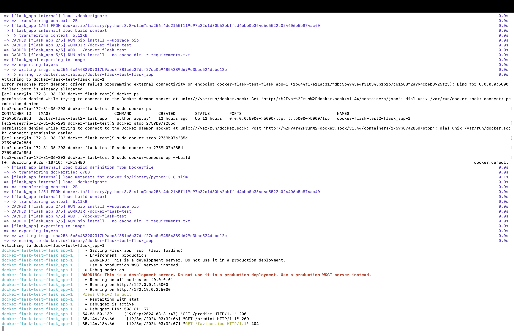
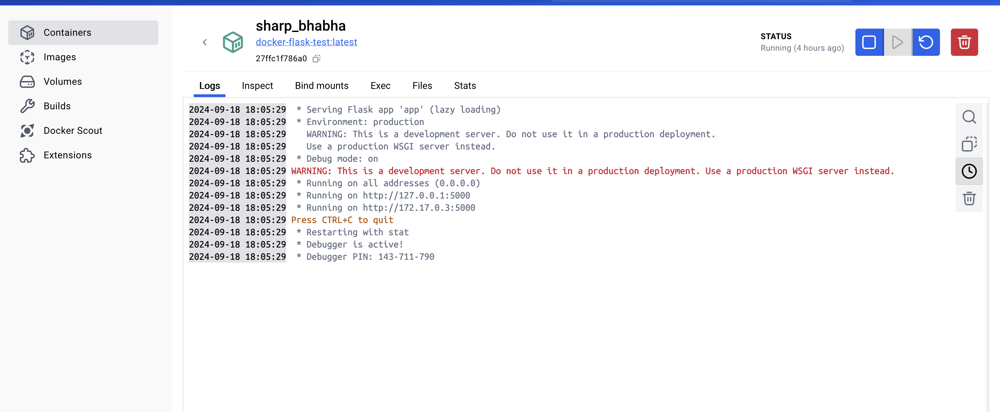
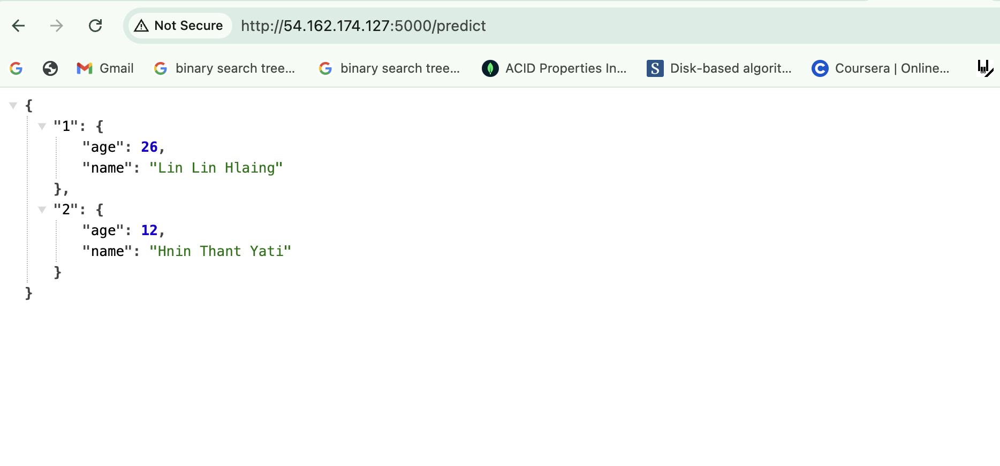
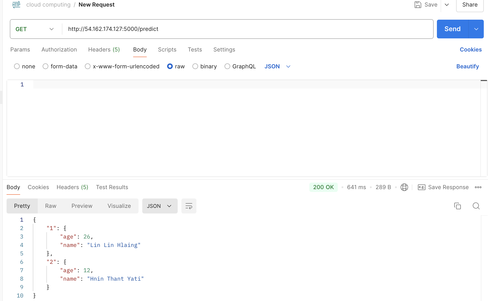

# docker-flask-test
This project is a simple demonstration of how to containerize a Flask application using Docker. It aims to provide a practical example of deploying a minimal Flask web app inside a Docker container for testing and development purposes.


This removing containers and images steps are not necessary. In my case I have already create but i want to create new docker container. 
To remove  remove all containers:
```bash
docker container rm -f$(docker container ls -q)
```

To remove all images:
```bash
docker image rm $(docker image ls -aq)
```

### Installation Instructions

Update the system packages:
```bash
sudo yum update -y
```

To install Docker Compose on your system, use the following commands:
```bash
sudo curl -L "https://github.com/docker/compose/releases/download/v2.22.0/docker-compose-$(uname -s)-$(uname -m)" -o /usr/local/bin/docker-compose

sudo chmod +x /usr/local/bin/docker-compose
```

Start the Docker service:
```bash
sudo service docker start
```

Add your user (ec2-user) to the Docker group to avoid using sudo with Docker commands:
```bash
sudo usermod -a -G docker ec2-user
```


Check the Docker Compose version to verify the installation:
```bash
docker-compose --version
```

Clone the repository:
```bash
git clone https://github.com/linlinhlaing/docker-flask-test.git
```

Navigate to the project directory:

```bash
cd docker-flask-test
```

Build the Docker image:

```bash
sudo docker build -t docker-flask-test .
```
Start the Docker container using Docker Compose:
```bash
sudo docker-compose up --build
```

After Start docker containter:



&nbsp;&nbsp;&nbsp;&nbsp;
&nbsp;&nbsp;&nbsp;&nbsp;

In docker:


&nbsp;&nbsp;&nbsp;&nbsp;
&nbsp;&nbsp;&nbsp;&nbsp;

Accessing the Application in web browser


&nbsp;&nbsp;&nbsp;&nbsp;
&nbsp;&nbsp;&nbsp;&nbsp;

Accessing the application in postman
is
